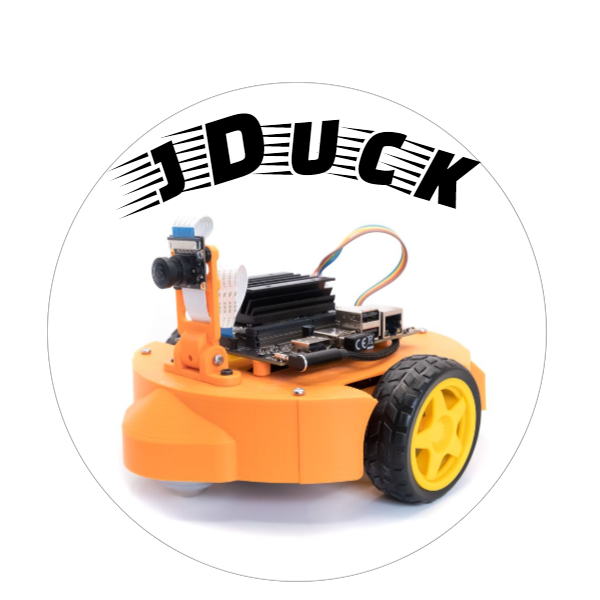
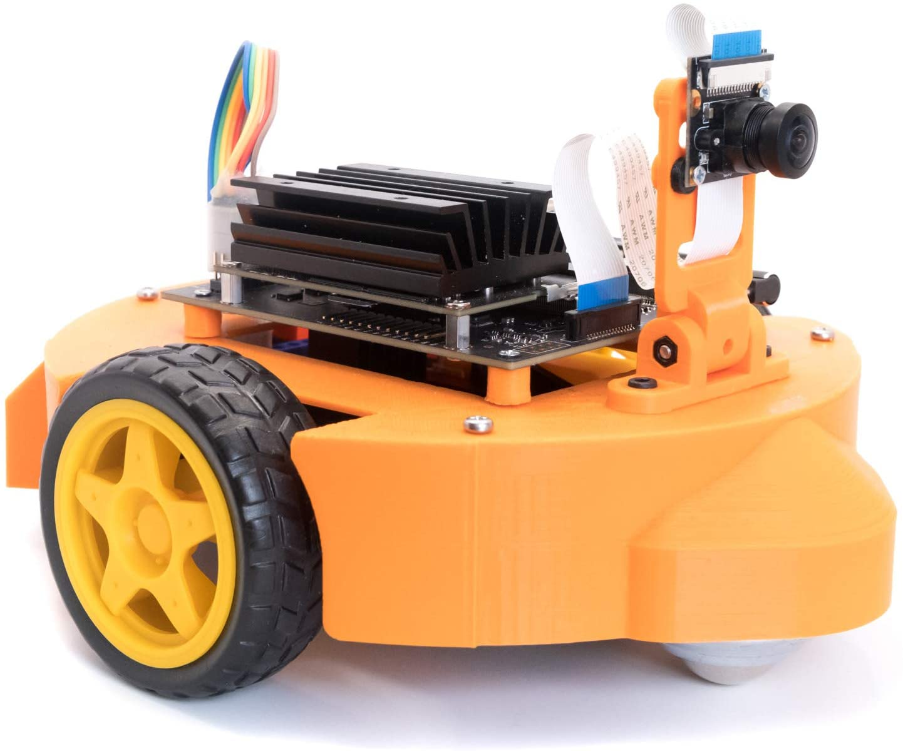

    
    <figcaption></figcaption>

We developed the jDuck robot platform for those who:
- :camera: :eyeglasses: :robot: Have great interest in designing deep learning model for computer-Vision applications and robotics.
- :muscle: :wrench: :rocket:  Get started to deploy the model on Jetson Nano Developer kit and have some funs.
- :hourglass_flowing_sand: :clock3: Would like to save time from setting up and debugging the hardware.

## :rocket: Product Summary

  - [x] **No need for hours of assembly**. Fully assembled and individually tested to ensure excellent working condition right out of the box..

  - [x] **Long time usage and easy charging**. The jDuck includes a large power bank, rechargeable lithium-ion battery (10000mAh).

  - [x] **Powered by NVIDIA® Jetson Nano TM  ** 2GB developer kit (sold separately), perfect for learning and teaching AI robotics.

  - [x] **Design and assemble in the USA**, the product is fully supported.

  - [x] **An affordable and friendly platform** to deploy many open-source projects on Github for collision avoidance, object recoginition, visioned-based line tracking.
  
  - [x] **Open-source software**

## [:truck: Buy on Amazon](https://www.amazon.com/dp/B08ZVBCT26?fbclid=IwAR0gwjj-hSZsaB4kF6pJWJAcfVp061Cgqmoh9smIQtiU6nPkkdqvsUPWj4I)

The jDuck is currently available on [Amazon](https://www.amazon.com/dp/B08ZVBCT26?fbclid=IwAR0gwjj-hSZsaB4kF6pJWJAcfVp061Cgqmoh9smIQtiU6nPkkdqvsUPWj4I) for $129.99 (with promotion coupon). It's fully assembled and individually tested to ensure excellent working condition right out of the box; no need for hours of assembly and hardware debugging.

<table>
<thead>
  <tr style=background-color:#ffa500>
    <th rowspan="1" colspan="1" style="text-align:center; width:30%">jDuck</th>
    <th rowspan="1" colspan="1" style="text-align:center">Components</th>
  </tr>
</thead>
<tbody>
  <tr>
    <td style="text-align:center">
  </td>
    <td colspan="1" style="text-align:center"></td>        
  </tr>
</tbody>
</table>

## :arrow_forward: Getting Started
Please visit our page for details intruction of hardware and software setup.
[:paperclip: Getting Started](https://luutp.github.io/jduck/hardware_setup/jduck_hardware_setup.html)
 
## :raised_hands: Contributions
- :question: :speech_balloon: Please visit [:paperclip: jDuck Discussion Page](https://github.com/luutp/jduck/dicussions) to ask question and discuss topics that are related to jDuck development
- :beetle:  To report bugs, please visit [:paperclip: Issues Page](https://github.com/luutp/jduck/issues)
- :sparkles: To submit pull request, please visit [:paperclip: Pull Request Page](https://github.com/luutp/jduck/pull)

 

    
    <figcaption></figcaption>

## :page_facing_up: Licence

