## Common Parts

<table>
<thead>    
    <tr>
        <th rowspan="1" colspan="1" style="text-align:center">Part</th>
        <th rowspan="1" colspan="1" style="text-align:center">Image</th>
        <th rowspan="1" colspan="1" style="text-align:center">URL</th>
        <th rowspan="1" colspan="1" style="text-align:center">Qty. Need</th>
        <th rowspan="1" colspan="1" style="text-align:center">Note</th>
    </tr>
</thead>
<tbody>
    <tr>    
        <td style="text-align:left">Camera</td>
        <td style="text-align:center"> 
	    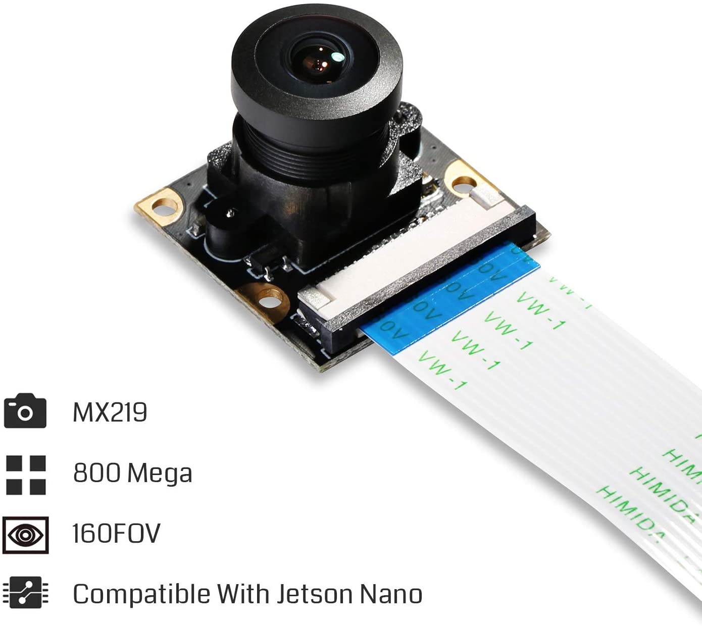
        </td>
        <td style="text-align:left"><a href = "https://amzn.to/2MwgSkg" target="_blank" > Amazon</a></td>
        <td style="text-align:left">1</td>
        <td style="text-align:left">Compatible with NVIDIA Jetson Nano Camera IMX219-160 8-Megapixels Camera</td>
    </tr>    
    <tr>    
        <td style="text-align:left">Power Bank</td>
        <td style="text-align:center"> 
	    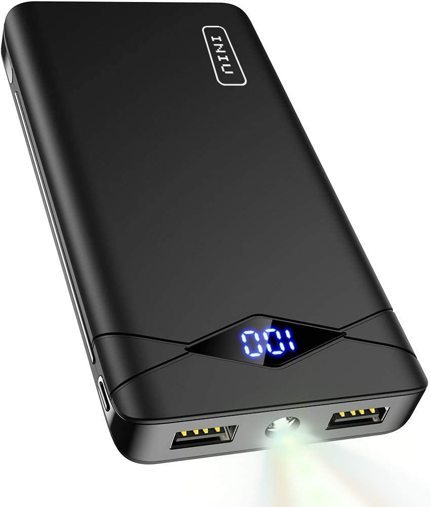 
        </td>
        <td style="text-align:left"><a href = "https://amzn.to/3apn4Co" target="_blank" > Amazon</a></td>
        <td style="text-align:left">1</td>
        <td style="text-align:left">Power Bank, LED Display 10000mAh Portable Charger, Dual 3A High-Speed 2 USB Ports</td>
    </tr>    
    <tr>    
        <td style="text-align:left">Motor Driver</td>
        <td style="text-align:center"> 
	    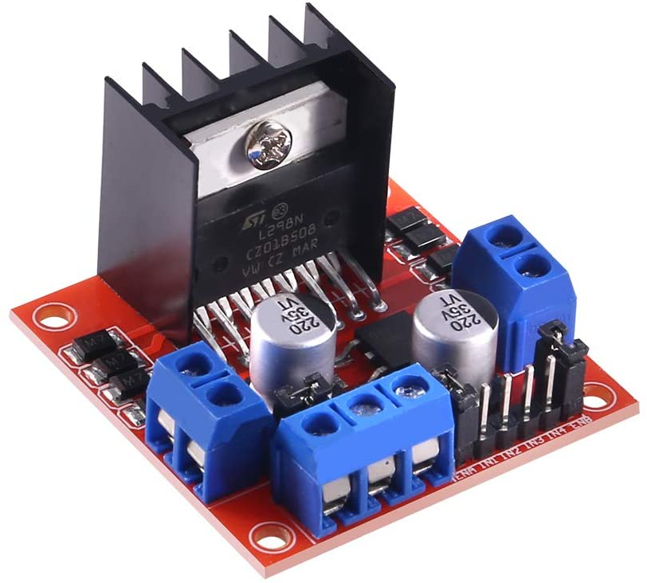 
        </td>
        <td style="text-align:left"><a href = "https://amzn.to/3re0X8S" target="_blank" > Amazon</a></td>
        <td style="text-align:left">1</td>
        <td style="text-align:left">L298N Stepper Motor Driver Controller Board Dual H Bridge Module</td>
    </tr>    
    <tr>    
        <td style="text-align:left">TT Motor + Wheel</td>
        <td style="text-align:center"> 
        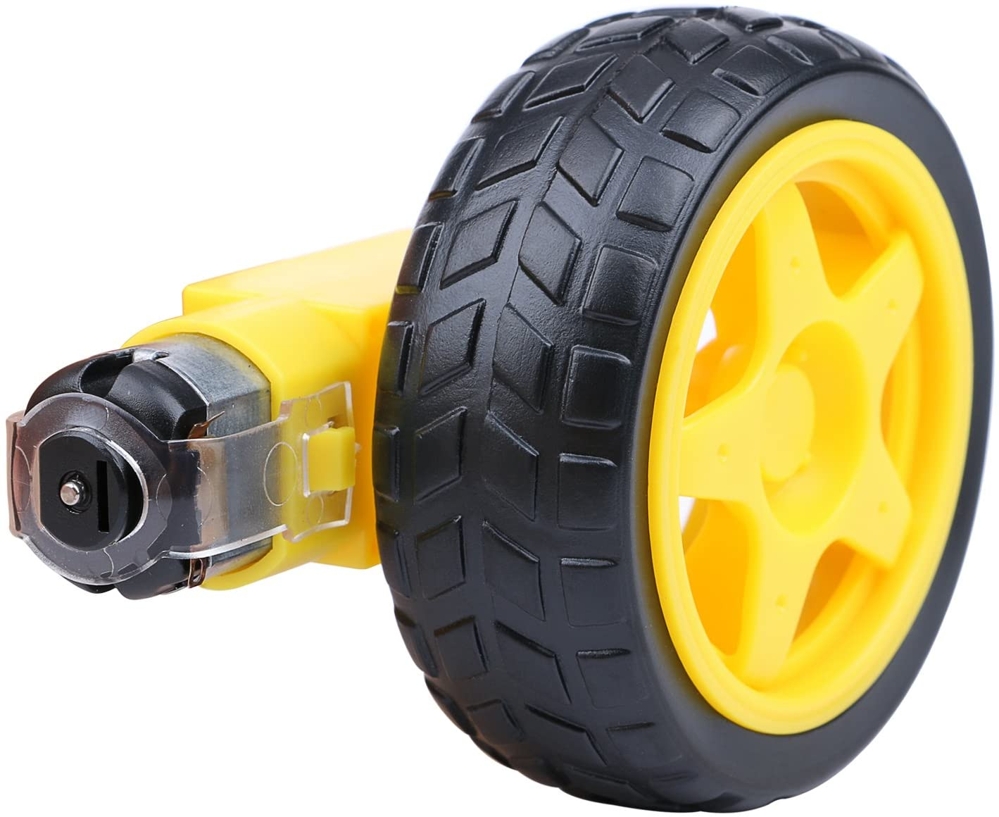 
        </td>
        <td style="text-align:left"><a href = "https://amzn.to/39Lk04F" target="_blank" > Amazon</a></td>
        <td style="text-align:left">2</td>
        <td style="text-align:left">4pcs DC Electric Motor 3-6V Dual Shaft Geared TT Magnetic Gearbox Engine with 4Pcs Plastic Car Tire Wheel</td>
    </tr>    
    <tr>    
        <td style="text-align:left">Rolling Ball Transfer</td>
        <td style="text-align:center"> 
	    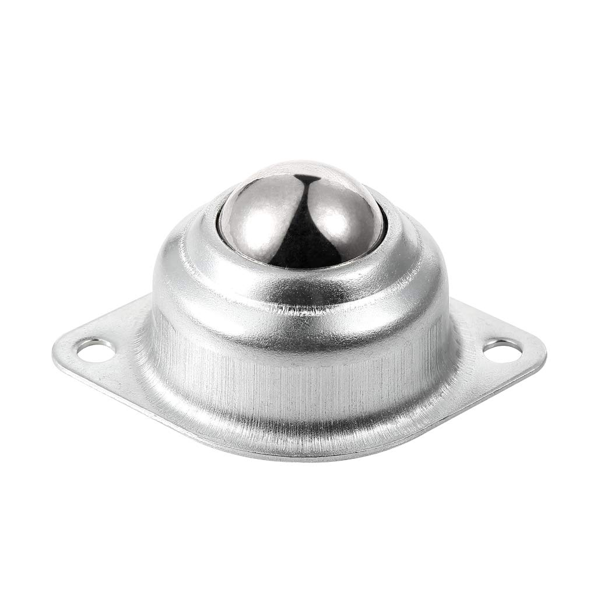 
        </td>
        <td style="text-align:left"><a href = "https://amzn.to/2MvQQO5" target="_blank" > Amazon</a></td>
        <td style="text-align:left">1</td>
        <td style="text-align:left">1” Rolling Ball Transfers </td>
    </tr>    
    <tr>    
        <td style="text-align:left">NVIDIA Jetson Nano 2GB *</td>
        <td style="text-align:center"> 
	    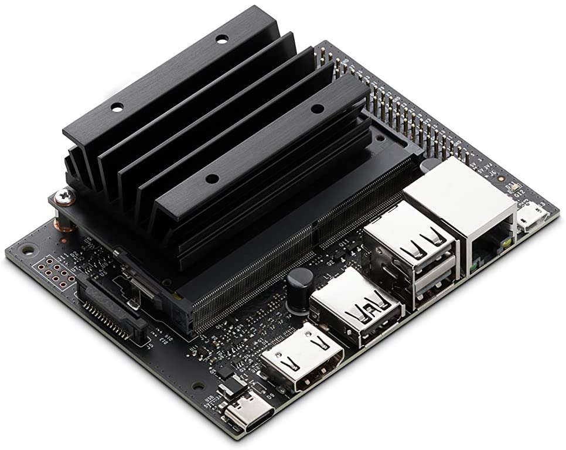 
        </td>
        <td style="text-align:left"><a href = "https://amzn.to/2MQ1rDh" target="_blank" > Amazon</a></td>
        <td style="text-align:left">1</td>
        <td style="text-align:left">Series: 945-13541-0000-000 includes usb wifi adapter and cable.
        Series: 945-13541-0001-000 does not include adapter and cable.</td>
    </tr>    
    <tr>    
        <td style="text-align:left">MicroSD Card *</td>
        <td style="text-align:center"> 
	    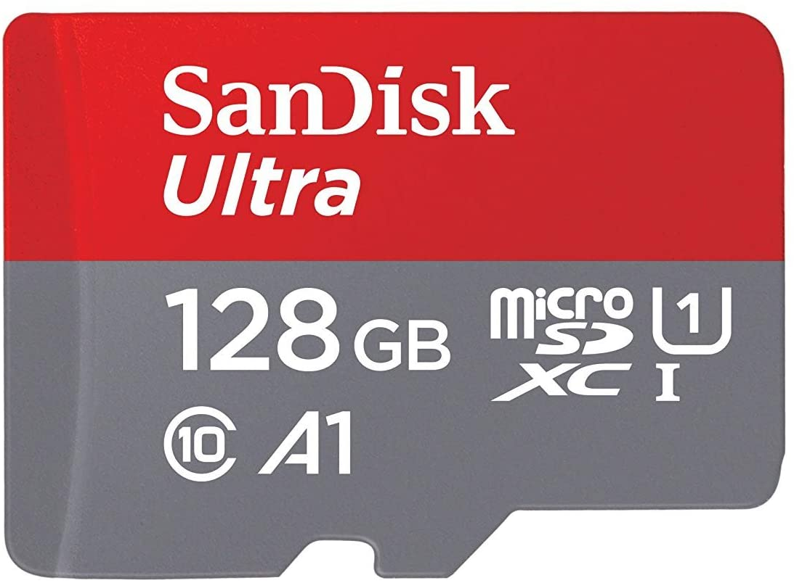 
        </td>
        <td style="text-align:left"><a href = "https://amzn.to/3axdWMb" target="_blank" > Amazon</a></td>
        <td style="text-align:left">1</td>
        <td style="text-align:left">128 GB</td>
    </tr>
</tbody>
</table>
!!! danger "Important"
    * Our JeNaBot product does <b>NOT</b> include NVIDIA Jeson Nano 2B and MicroSD Card

## Wires and Cables

<table>
<thead>    
    <tr>
        <th rowspan="1" colspan="1" style="text-align:center">Part</th>
        <th rowspan="1" colspan="1" style="text-align:center">Image</th>
        <th rowspan="1" colspan="1" style="text-align:center">URL</th>
        <th rowspan="1" colspan="1" style="text-align:center">Qty. Need</th>
        <th rowspan="1" colspan="1" style="text-align:center">Note</th>
    </tr>
</thead>
<tbody>    
    <tr>    
        <td style="text-align:left">USB C</td>
        <td style="text-align:center"> 
	        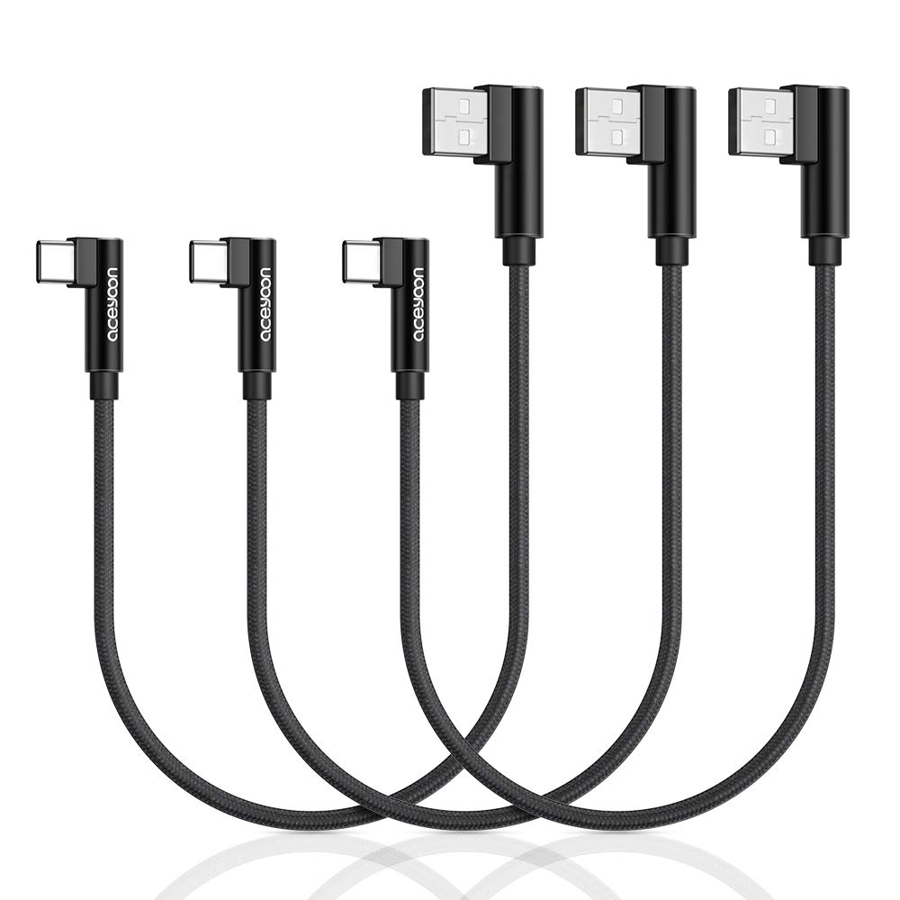 
        </td>
        <td style="text-align:left"><a href = "https://amzn.to/3cAuKEM" target="_blank" > Amazon</a></td>
        <td style="text-align:left">1</td>
        <td style="text-align:left">Right Angle USB C 1ft</td>
    </tr>    
    <tr>    
        <td style="text-align:left">USB Type A</td>
        <td style="text-align:center"> 
	        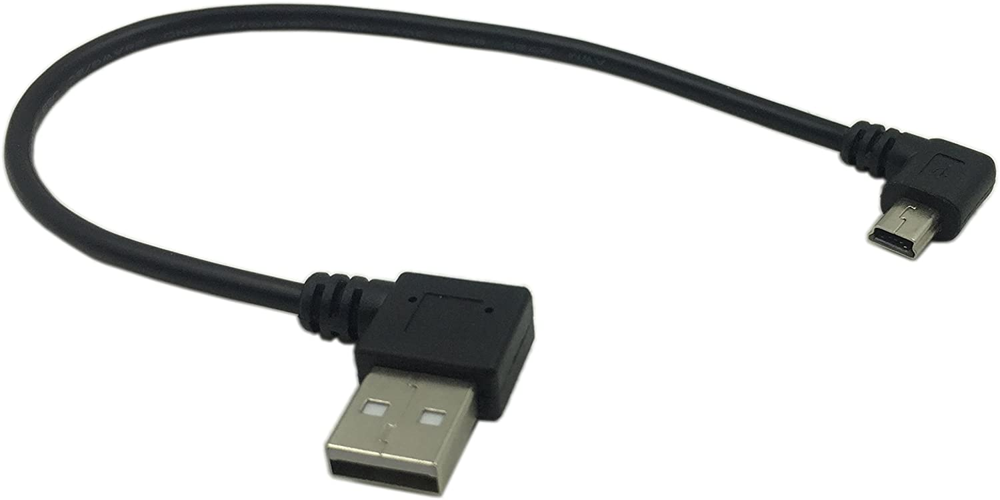 
        </td>
        <td style="text-align:left"><a href = "https://amzn.to/3pIlSAC" target="_blank" > Amazon</a></td>
        <td style="text-align:left">1</td>
        <td style="text-align:left">USB Type A 2.0 Left Angle Male 9 inches</td>
    </tr>    
</tbody>
</table>

## Bolts and Nuts

<table>
<thead>    
    <tr>
        <th rowspan="1" colspan="1" style="text-align:center">Part</th>
        <th rowspan="1" colspan="1" style="text-align:center">Image</th>
        <th rowspan="1" colspan="1" style="text-align:center">URL</th>
        <th rowspan="1" colspan="1" style="text-align:center">Qty. Need</th>
        <th rowspan="1" colspan="1" style="text-align:center">Note</th>
    </tr>
</thead>
<tbody>    
    <tr>    
        <td style="text-align:left">M3 x 8mm</td>
        <td style="text-align:center"> 
	        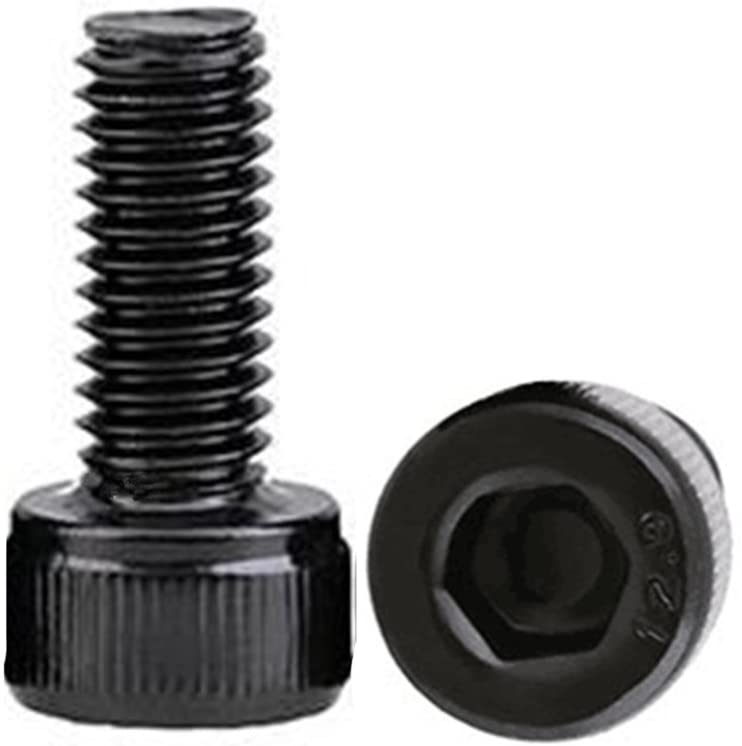 
        </td>
        <td style="text-align:left"><a href = "https://amzn.to/36CPCHA" target="_blank" > Amazon</a></td>
        <td style="text-align:left">8</td>
        <td style="text-align:left">Hex Socket Head Cap ,Black Oxide Finish</td>
    </tr>    
    <tr>    
        <td style="text-align:left">M3 x 10mm</td>
        <td style="text-align:center"> 
	         
        </td>
        <td style="text-align:left"><a href = "https://amzn.to/36EJTB2" target="_blank" > Amazon</a></td>
        <td style="text-align:left">6</td>
        <td style="text-align:left">Hex Socket Head Cap ,Black Oxide Finish</td>
    </tr>    
    <tr>    
        <td style="text-align:left">M3 x 25mm</td>
        <td style="text-align:center"> 
	        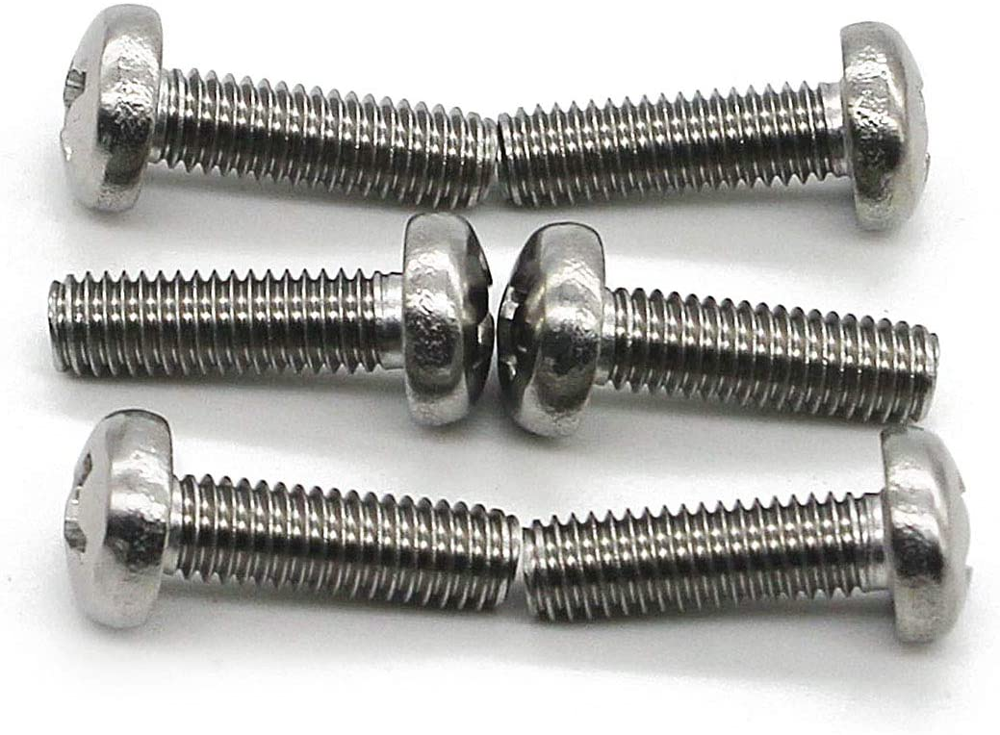 
        </td>
        <td style="text-align:left"><a href = "https://amzn.to/3pPhW11" target="_blank" > Amazon</a></td>
        <td style="text-align:left">9</td>
        <td style="text-align:left">Pan Head Phillips Machine Screws,18-8 Stainless Steel</td>
    </tr>        
    <tr>    
        <td style="text-align:left">M3 Nuts</td>
        <td style="text-align:center"> 
	        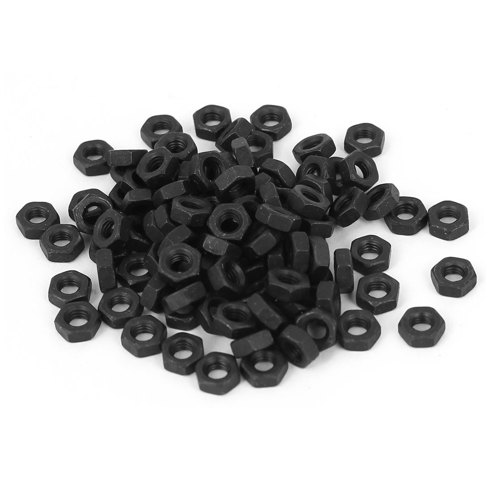 
        </td>
        <td style="text-align:left"><a href = "https://amzn.to/36GSG5z" target="_blank" > Amazon</a></td>
        <td style="text-align:left">23</td>
        <td style="text-align:left">Hex Nut Black Carbon Steel</td>
    </tr>    
    <tr>    
        <td style="text-align:left">M3 Insert</td>
        <td style="text-align:center"> 
            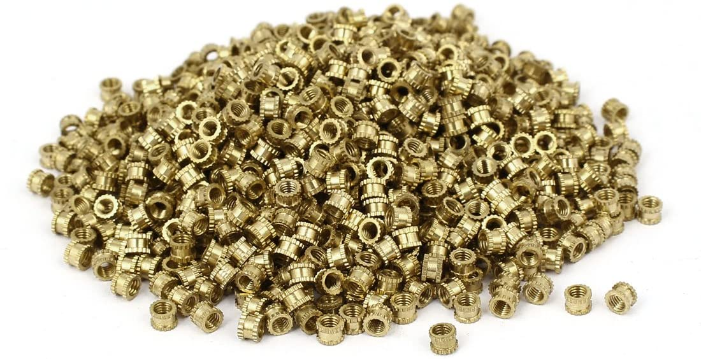 
        </td>        
        <td style="text-align:left"><a href = "https://amzn.to/31cG2YW" target="_blank" > Amazon</a></td>
        <td style="text-align:left">4</td>
        <td style="text-align:left">M3x3.2mmx4.1mm Brass Female Threaded Knurl Insert Embedded Nut Fastener</td>
    </tr>    
    <tr>    
        <td style="text-align:left">M2 x 12mm</td>
        <td style="text-align:center"> 
	        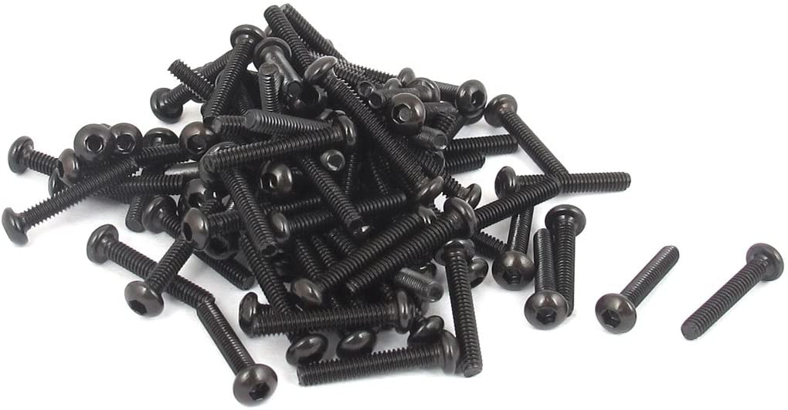 
        </td>
        <td style="text-align:left"><a href = "https://amzn.to/36EdHxY" target="_blank" > Amazon</a></td>
        <td style="text-align:left">4</td>
        <td style="text-align:left">M2 Phillips Round Pan Head</td>
    </tr>    
    <tr>    
        <td style="text-align:left">M2 x 8mm</td>
        <td style="text-align:center"> 
	        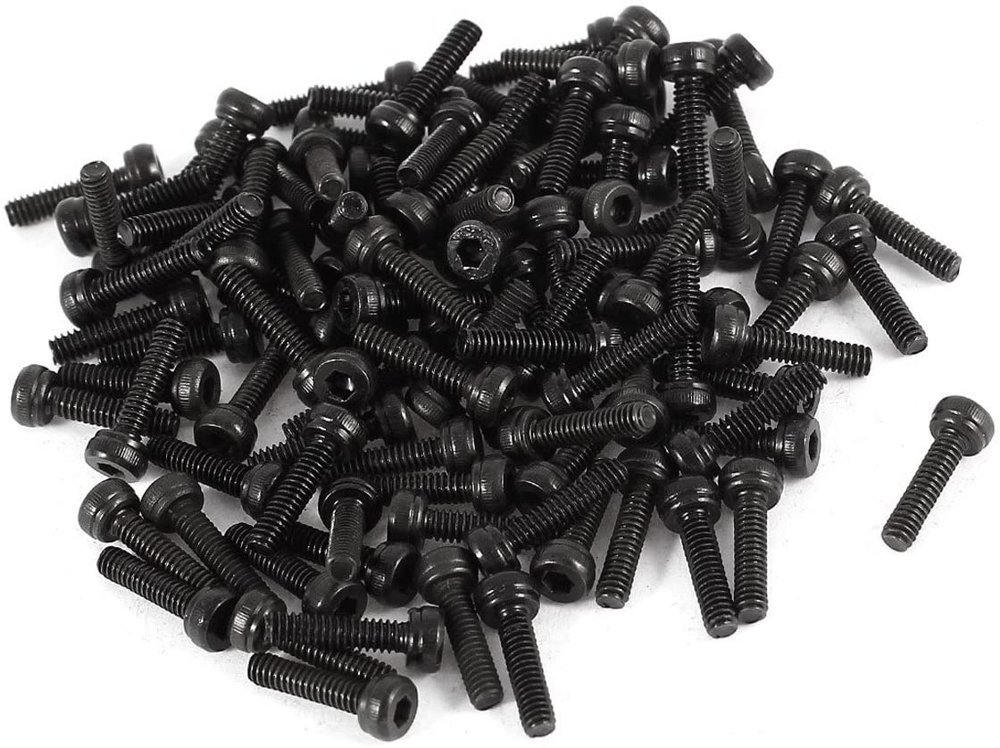 
        </td>
        <td style="text-align:left"><a href = "https://amzn.to/36EdHxY" target="_blank" > Amazon</a></td>
        <td style="text-align:left">2</td>
        <td style="text-align:left">M2 Phillips Round Pan Head</td>
    </tr>    
    <tr>    
        <td style="text-align:left">M2 Nuts</td>
        <td style="text-align:center"> 
	        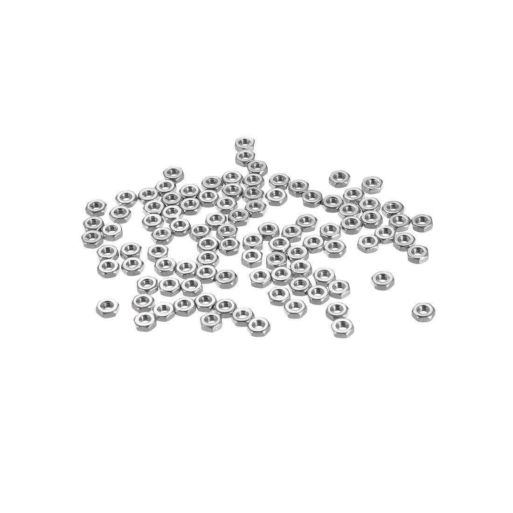 
        </td>
        <td style="text-align:left"><a href = "https://amzn.to/39IP0SB" target="_blank" > Amazon</a></td>
        <td style="text-align:left">2</td>
        <td style="text-align:left">Hexagon Nut, Stainless Steel 304</td>
    </tr>    
    <tr>    
        <td style="text-align:left">M2 Brass Insert</td>
        <td style="text-align:center"> 
	        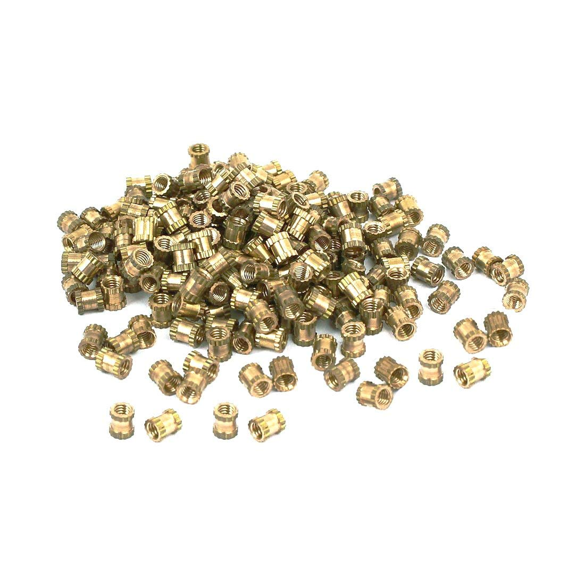 
        </td>
        <td style="text-align:left"><a href = "https://amzn.to/3vT9Rf3" target="_blank" > Amazon</a></td>
        <td style="text-align:left">4</td>
        <td style="text-align:left">M2 Brass Cylindrical Knurled Threaded Insert Embedded Nuts</td>
    </tr>    
</tbody>
</table>
