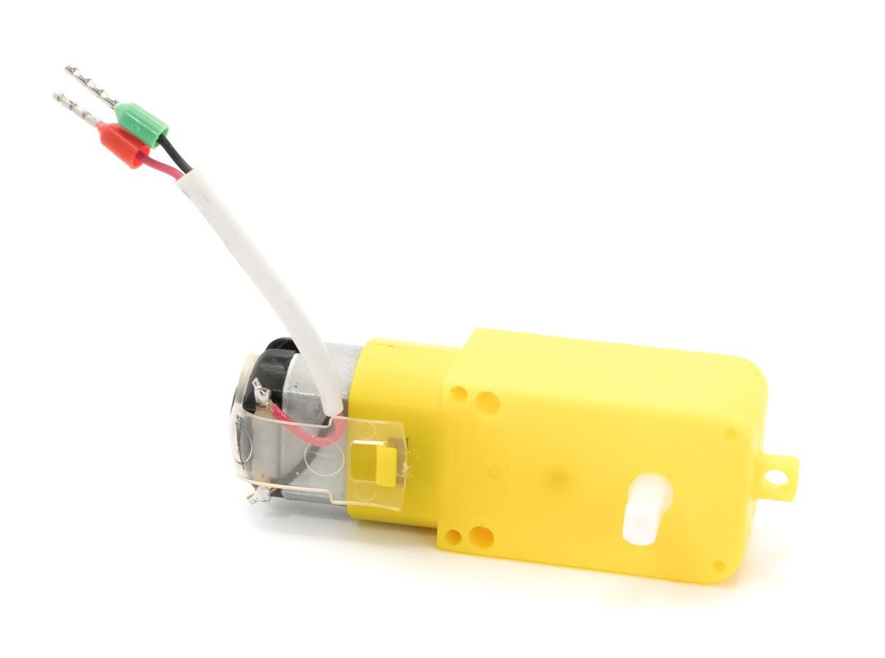
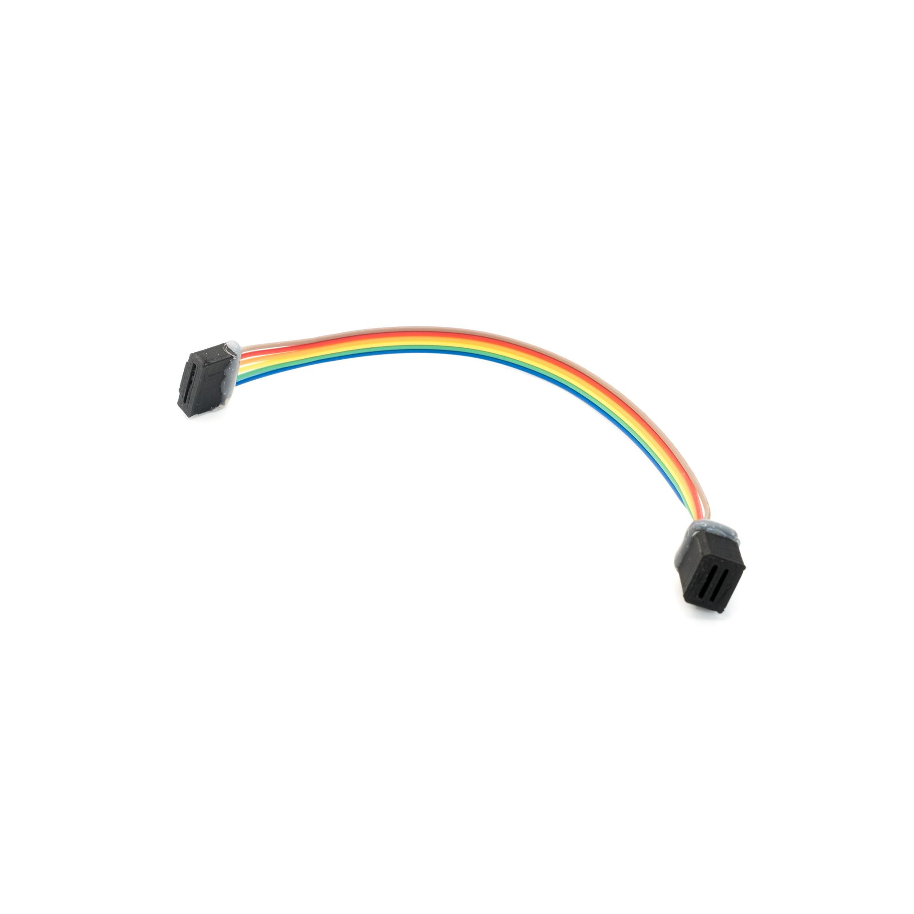
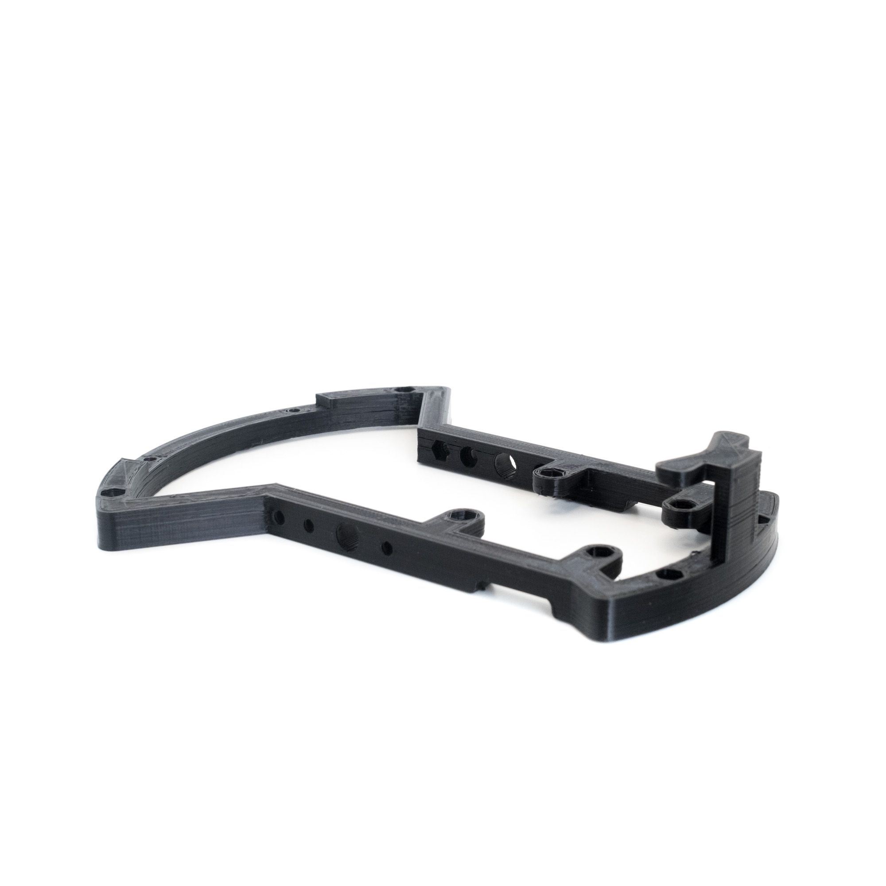
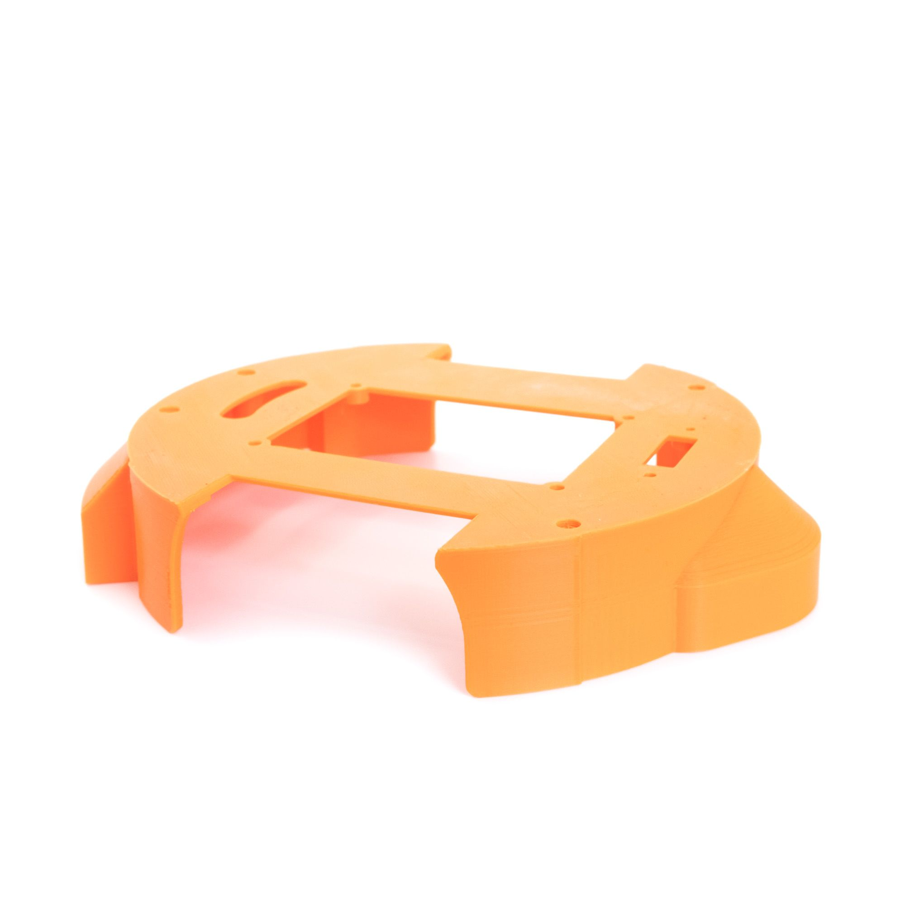
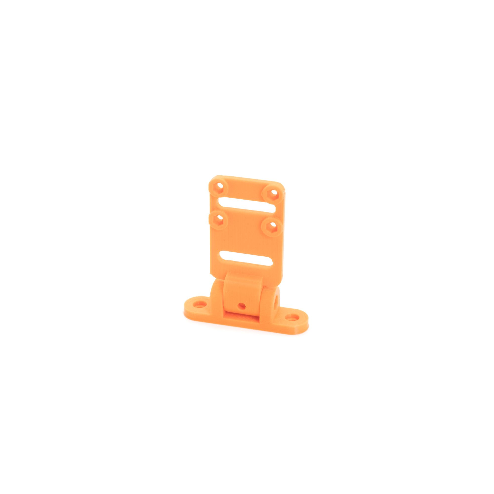
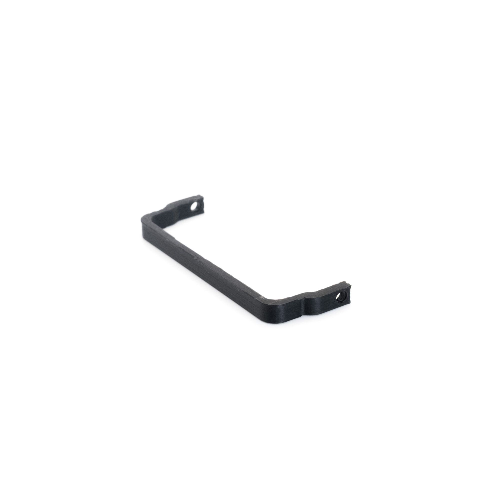
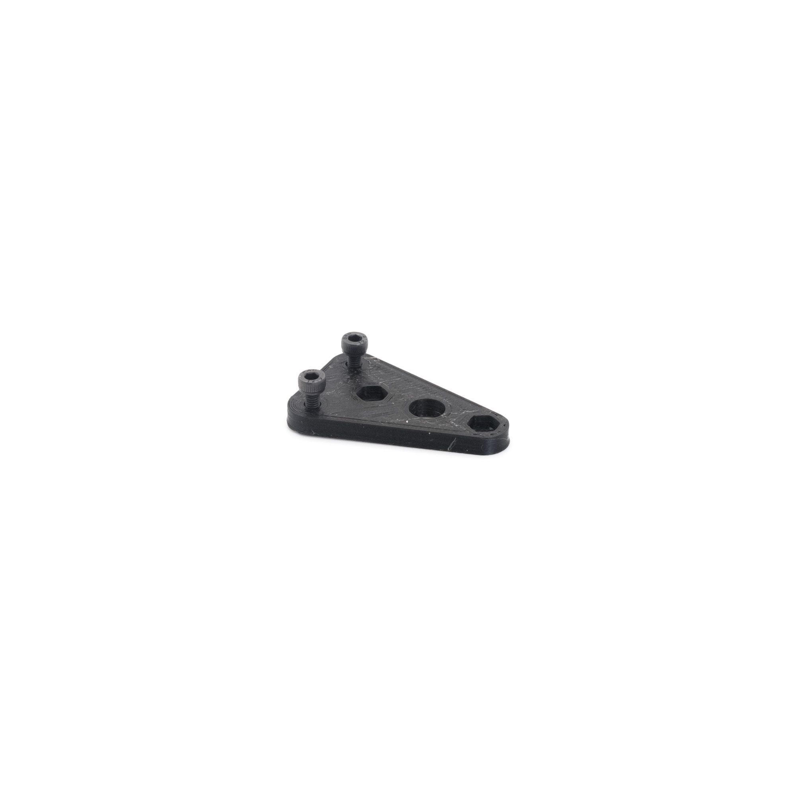
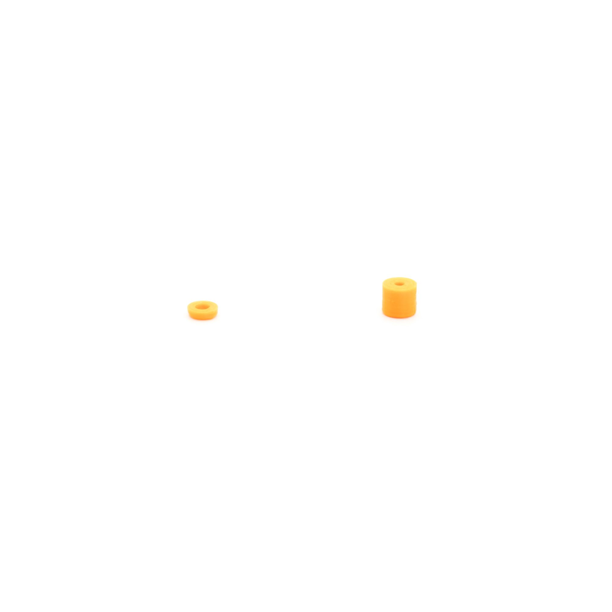

## Common parts

<table>
<thead>    
    <tr>
        <th rowspan="1" colspan="1" style="text-align:center">Part</th>
        <th rowspan="1" colspan="1" style="text-align:center">Image</th>
        <th rowspan="1" colspan="1" style="text-align:center">Qty. Need</th>
        <th rowspan="1" colspan="1" style="text-align:center">Note</th>
    </tr>
</thead>
<tbody>
    <tr>    
        <td style="text-align:left">Motors with wires and connectors</td>    
        <td style="text-align:center"> 
	         
        </td>               
        <td style="text-align:left">2</td>
        <td style="text-align:left">Wires were cut to correct size and crimped with ferrule terminals</td>
    </tr>    
    <tr>    
        <td style="text-align:left">Jetson to Motor Driver Cable</td>    
        <td style="text-align:center"> 
	         
        </td>   
        <td style="text-align:left">1</td>
        <td style="text-align:left">Connectors were 3D-printed to custom fit with Jetson headers and Motor Driver</td>
    </tr>    
</tbody>
</table>
## 3D-printed parts

<table>
<thead>    
    <tr>
        <th rowspan="1" colspan="1" style="text-align:center">Part</th>
        <th rowspan="1" colspan="1" style="text-align:center">Image</th>
        <th rowspan="1" colspan="1" style="text-align:center">Qty. Need</th>
        <th rowspan="1" colspan="1" style="text-align:center">Note</th>
    </tr>
</thead>
<tbody>
    <tr>    
        <td style="text-align:left">jDuck Frame</td>   
        <td style="text-align:center"> 
	         
        </td>
        <td style="text-align:left">1</td>
        <td style="text-align:left">Frame</td>
    </tr>    
    <tr>    
        <td style="text-align:left">Top Cover</td>   
        <td style="text-align:center"> 
	         
        </td>
        <td style="text-align:left">1</td>
        <td style="text-align:left">Top Cover</td>
    </tr>    
    <tr>    
        <td style="text-align:left">Camera Holder Set</td>   
        <td style="text-align:center"> 
	         
        </td>
        <td style="text-align:left">1</td>
        <td style="text-align:left">Camera holder with adjustable angle</td>
    </tr>    
    <tr>    
        <td style="text-align:left">Battery Strap</td>   
        <td style="text-align:center"> 
	         
        </td>
        <td style="text-align:left">1</td>
        <td style="text-align:left">Secure the power bank to the bottom frame</td>
    </tr>    
    <tr>    
        <td style="text-align:left">DC Motor Base</td>   
        <td style="text-align:center"> 
	         
        </td>
        <td style="text-align:left">2</td>
        <td style="text-align:left">Connect DC motors to the bottom frame</td>
    </tr>    
    <tr>    
        <td style="text-align:left">Spacers</td>   
        <td style="text-align:center"> 
	         
        </td>
        <td style="text-align:left">10</td>
        <td style="text-align:left">Spacers</td>
    </tr>    
    
</tbody>
</table>
