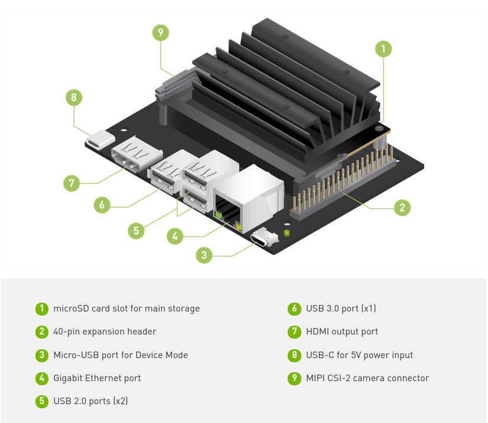

## L298N Motor Driver
This L298N Motor Driver Module is a high power motor driver module for driving DC and Stepper Motors. This module consists of an L298 motor driver IC and a 78M05 5V regulator. L298N Module can control up to 4 DC motors, or 2 DC motors with directional and speed control.

 
	 
    <figcaption>L298N pinout</figcaption>

## NVIDIA® Jetson NanoTM  2GB Developer Kit
> The NVIDIA® Jetson Nano™ 2GB Developer Kit is ideal for hands-on projects. Learning by doing is key for anyone new to AI and robotics, and with this developer kit you’ll see your work perceiving and interacting with the world around you in real-time.

[:paperclip: Getting Started with Jetson Nano 2GB Developer Kit](https://developer.nvidia.com/embedded/learn/get-started-jetson-nano-2gb-devkit)

 
	 
	<figcaption>NVIDIA® Jetson NanoTM  2GB Developer Kit</figcaption> 

## 40-Pin Header (J6)

The 40-pin header provides access to power, ground, and interface signal pins.

 
	 
	<figcaption>40-Pin Header (J6)</figcaption> 

???+ info "jDuck wiring connection"
    The jDuck only connects 6 pins from J6 to the L298N driver to control the left and right DC motors
    === "Left Motor"
        * Pin 32
        * Pin 36
        * Pin 38    
    === "Right Motor"
        * Pin 33
        * Pin 35
        * Pin 37
    More details for software setup to enable PWM on the Jetson Nano is available at [Docker: Enable PWM](../software_setup/docker/docker_enable_pwm.md)    