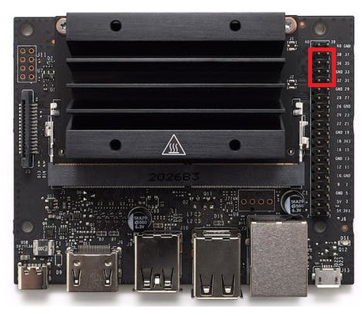

- [Connect CSI camera to Jetson Nano board](#connect-csi-camera-to-jetson-nano-board)
- [Connect Motor Driver to Jetson Nano Board](#connect-motor-driver-to-jetson-nano-board)
- [Connect USB-C Power Cable](#connect-usb-c-power-cable)
- [Power ON/OFF](#power-onoff)

## Connect CSI camera to Jetson Nano board
To install a camera module, connect its flex ribbon cable into the camera connector (J5). Follow these steps:

1. **Gently lift up the the connector latch on the Jetson Nano board** </li>
2. **Insert the camera ribbon cable**. The metal contacts should face toward the center of the developer kit.</li>
3. **Gently press down on the connector latch until stops**. This may require two fingers, each at one end of the latch. Do not use excessive force.</li>
    

    
    <figcaption>Connect CSI camera to Jetson Nano</figcaption>

???+ tip "FFC Cable Direction"
    Set the metal side of the FFC cable into the heat-sink of the Jetson board

## Connect Motor Driver to Jetson Nano Board
We use 6 pins from J6 header on the Jetson Nano to the L298N driver.
<table>
<thead>
    <tr style=background-color:#e6e6e6>
        <th rowspan="1" colspan="1" style="text-align:center">Left Motor</th>
        <th rowspan="1" colspan="1" style="text-align:center">Right Motor</th>
        <th rowspan="1" colspan="1" style="text-align:center">Connection Pins</th>
    </tr>
</thead>
<tbody>
    <tr>
        <td style="text-align:left">Pin 32</td>
        <td style="text-align:left">Pin 33</td>        
        <td rowspan="3" style="text-align:center"></td>        
    </tr>
    <tr>
        <td style="text-align:left">Pin 36</td>
        <td style="text-align:left">Pin 35</td>        
    </tr>
    <tr>
        <td style="text-align:left">Pin 38</td>
        <td style="text-align:left">Pin 37</td>        
    </tr>    
</tbody>
</table>
Details for the electrical wiring are available at. [:paperclip: Electrical wiring](electrical_wiring.md){:target="_blank"}

    
    <figcaption>Connect Motor Driver to Jetson Nano Board</figcaption>

???+ tip "Motor Driver Connector"
    Set the small side of the ribbon cable connector into the heat-sink of the Jetson board
## Connect USB-C Power Cable

    
    <figcaption>Connect USB-C power cable</figcaption>

## Power ON/OFF

=== "Power ON"
    Click the power button on the power bank to turn ON jDuck.
    
    A clear LED digital readout shows the accurate percentage of power level. No more guessing about the remaining power and when to recharge.
    

        
        <figcaption>Power ON</figcaption>
    

    
=== "Power OFF"
    Double-click the power button on the power bank to turn OFF jDuck.
    

        
        <figcaption>Power OFF</figcaption>
    

