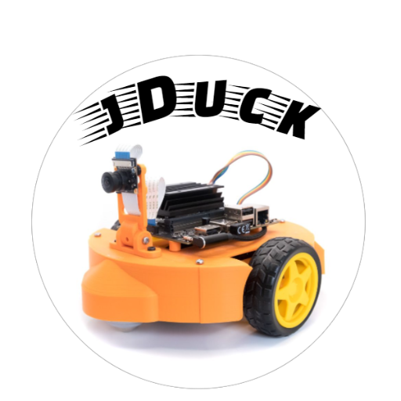
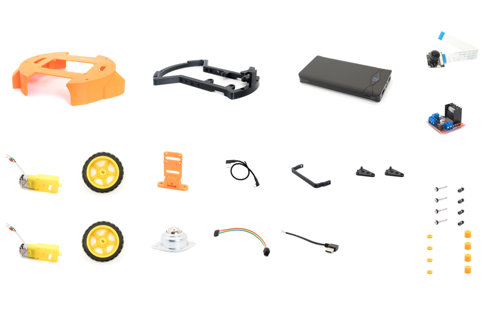

    
    <figcaption></figcaption>

<a href="https://www.amazon.com/dp/B08ZVBCT26?fbclid=IwAR0gwjj-hSZsaB4kF6pJWJAcfVp061Cgqmoh9smIQtiU6nPkkdqvsUPWj4I" title="Amazon" target = "_blank" class="md-button md-button--primary text-center">
:fontawesome-brands-amazon: Buy
</a>

## Product Summary
!!! summary "Why jDuck?"

    - [x] **No need for hours of assembly**. Fully assembled and individually tested to ensure excellent working condition right out of the box..

    - [x] **Long time usage and easy charging**. The jDuck includes a large power bank, rechargeable lithium-ion battery (10000mAh).

    - [x] **Powered by NVIDIA® Jetson Nano TM  ** 2GB developer kit (sold separately), perfect for learning and teaching AI robotics.

    - [x] **Design and assemble in the USA**, the product is fully supported.

    - [x] **An affordable and friendly platform** to deploy many open-source projects on Github for collision avoidance, object recoginition, visioned-based line tracking.

With the blooming of artificial intelligence technology in recent years, there is an increased demand in building AI robots for numerous practical applications such as in helping with every day chores or automating more complex and high-level tasks in manufacturing sectors. That attracts a lot of students and enthusiasts to start exploring and learning about AI robotics. Yet, the threshold of creation is quite high. Either the cost could be prohibitive or building a robot from scratch is taking too much time and effort. To address this gap, we provide a reliable and reasonably priced robot to help students and enthusiasts starting their hands-on experience .

## You build the “brain”, we got the body.

Our jDuckTM robots are fully assembled. Thus, there is no worries about hours of assembly and reading instructions. After taking it out of the box, it’ll take approximately five minutes for you to put your Jetson Nano in place and the robot will be ready. And if you ever wonder how all parts and wires are previously connected, a detailed description is provided on our
website.

To ensure an excellent working condition right out of the box, products are individually tested. Each of them is quality checked by qualified personnel to eliminate unnecessary troubles so that you can focus on building the “brain” of your robot.

The product includes:

- [Commercially available parts](hardware_setup/commercial_parts.md)
- [Custom design and 3D-printed parts](hardware_setup/custom_parts.md)

 
	 
	<figcaption>jDuck components</figcaption> 

## Open-source software developed for NVIDIA® Jetson Nano 2GB developer Kit

The NVIDIA Jetson Nano 2GB Developer Kit (not included in the jDuck) is ideal for teaching, learning, and developing AI and robotics.

> With an active developer community and ready-to-build open-source projects, you’ll find all the resources you need to get started. It delivers incredible AI performance at a low price and makes the world of AI and robotics accessible to everyone with the exact same NVIDIA software and tools used to create breakthrough AI products across all industries.

On this page, our team provides Docker setup and examples to help you jumpstart your AI projects.
