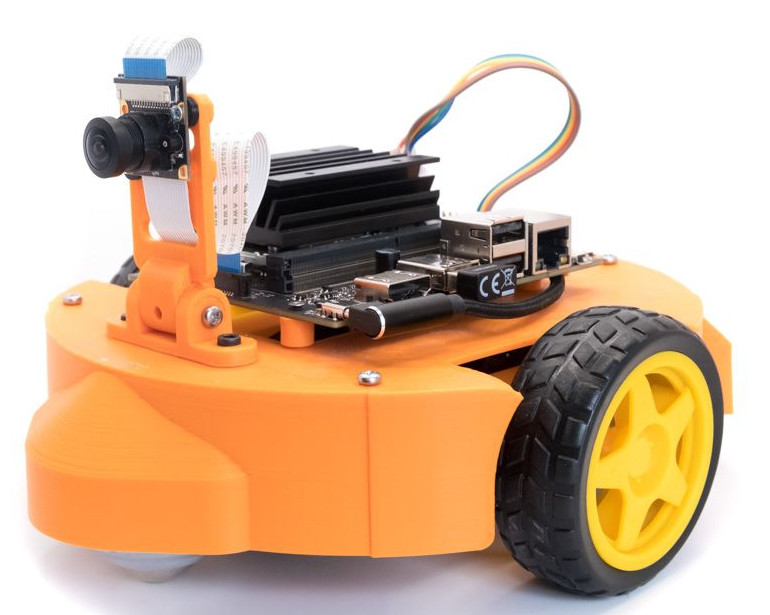

# jDuck

## Description

???+ example "Example"    
    === "Tab 1 Title"
        content 1
    === "Tab 2 Title"
        Content 2

``` python linenums="1"
import tensorflow as tf
```



[:fontawesome-brands-amazon: Buy](https://amazon.com){ .md-button .text-center }

!!! example

    === "Unordered List"

        _Example_:

        ``` markdown
        * Sed sagittis eleifend rutrum
        * Donec vitae suscipit est
        * Nulla tempor lobortis orci
        ```

        _Result_:

        * Sed sagittis eleifend rutrum
        * Donec vitae suscipit est
        * Nulla tempor lobortis orci

    === "Ordered List"

        _Example_:

        ``` markdown
        1. Sed sagittis eleifend rutrum
        2. Donec vitae suscipit est
        3. Nulla tempor lobortis orci
        ```

        _Result_:

        1. Sed sagittis eleifend rutrum
        2. Donec vitae suscipit est
        3. Nulla tempor lobortis orci

[Subscribe to our mailing list](#){: .md-button }

:beetle: Debug this

:envelope: luubot2207@gmail.com
