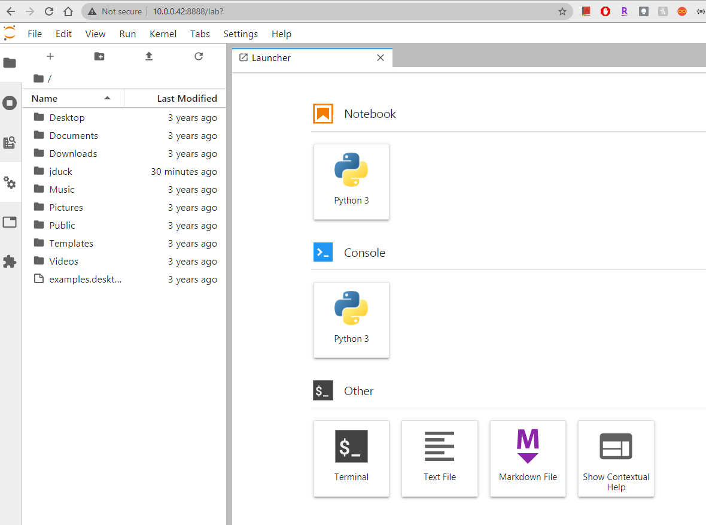
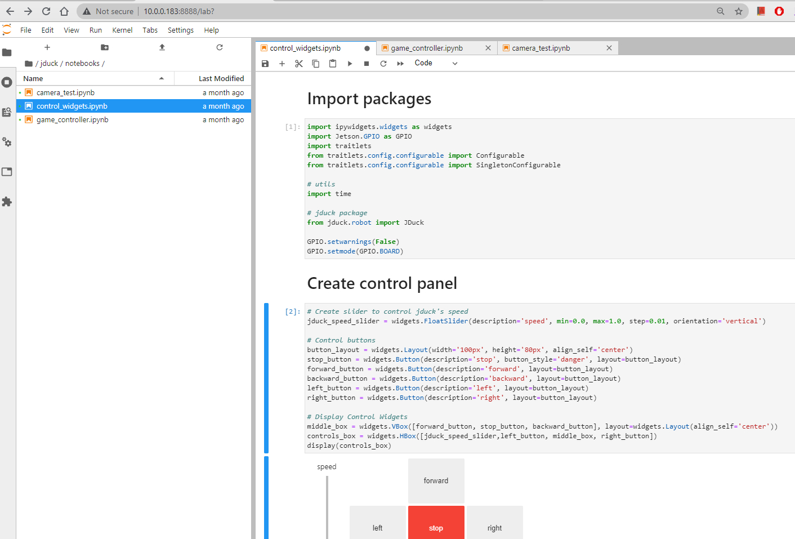
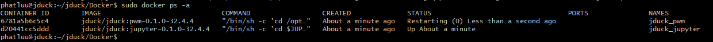

# Software setup for jDuck using Docker Container

## Step1: Clone jduck repos from our github

``` sh
git clone http://github.com/luutp/jduck.git
```
## Step2: Build and enable Docker containers
`cd` to `jduck/Docker` directory

``` sh
cd jduck/Docker
```

???+ info "Docker Directory"
    The contents of the Docker directory is shown as belows:
    ``` bash linenums="0"
    📦Docker
    ┣ 📂base
    ┣ 📂enable_pwm
    ┣ 📂jupyter
    ┣ 📜build.sh
    ┣ 📜configure.sh
    ┣ 📜disable.sh
    ┣ 📜enable.sh
    ┗ 📜set_nvidia_runtime.sh
    ```

Build all of the docker containers

```sh
bash ./build.sh
```

Run all of the docker containers
``` bash
bash ./enable.sh
```

## Open jupyterlab from host PC/laptop browser

From your host PC/laptop browser, type in the following address:

YOUR_JDUCK_IP_ADDRESS:8888/lab?

password: jduck



## Open example Notebooks

Go to jduck/notebooks for basic examples that control the robot via control panel or gamepad controller.



???+ info "Docker Tips"
    Once you execute the enable.sh script, the containers are set to restart automatically. This means you can shut down your jDuck, and when you reboot the containers will run and you don't need to repeat this process.

    To prevent the containers from starting automatically, just call the disable.sh script.
    ``` bash
        cd ~/jduck/Docker
        bash ./disable.sh
    ```

    Run "docker ps" to list containers that are currently running. The jduck:pwm and jduck:jupyter containers should be available after step 2.

    ``` bash
    sudo docker ps -a
    ```

    
