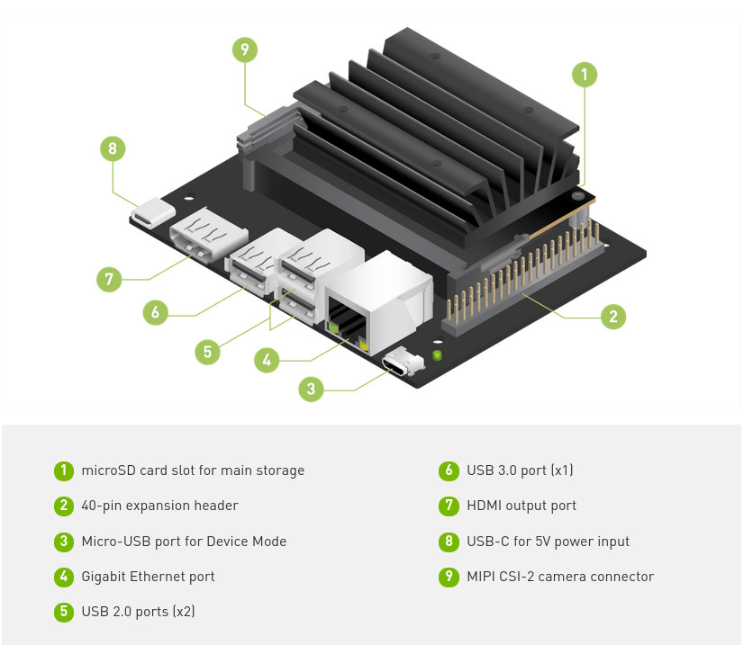

## Setup Jetson Nano 2GB Developer Kit

If you haven't already, go through the initial setup of Jetson Nano. 
You can use your existing Jetson Nano set up (microSD card), as long as you have enough storage space left.

???+ warning "Jetpack SDK Version"
    The current version of jDuck containers only supports Jetson Nano SD card image flashed with JetPack 4.4.1. These containers will not work with other version of JetPack. The JetPack archive image is available at
    [JetPack SDK 4.4.1 archive](https://developer.nvidia.com/jetpack-sdk-441-archive)

## Introduction

## Getting Started with Jetson Nano 2GB Developer Kit

???+ hint "Getting Started with Jetson Nano 2GB Developer Kit"

    For this, we'll assume you've set up your Jetson Nano using the **online Getting Started guide**.
     - [Getting Started with Jetson Nano 2GB Developer Kit](https://developer.nvidia.com/embedded/learn/get-started-jetson-nano-2gb-devkit)

### Step 1: Write Image to the microSD card 
???+ hint "Jetpack SDK 4.4.1"
    Supported Jet
    [Write Image to the microSD card](https://developer.nvidia.com/embedded/learn/get-started-jetson-nano-2gb-devkit#write){:target="_blank"}

### Step 2: Setup and First Boot
